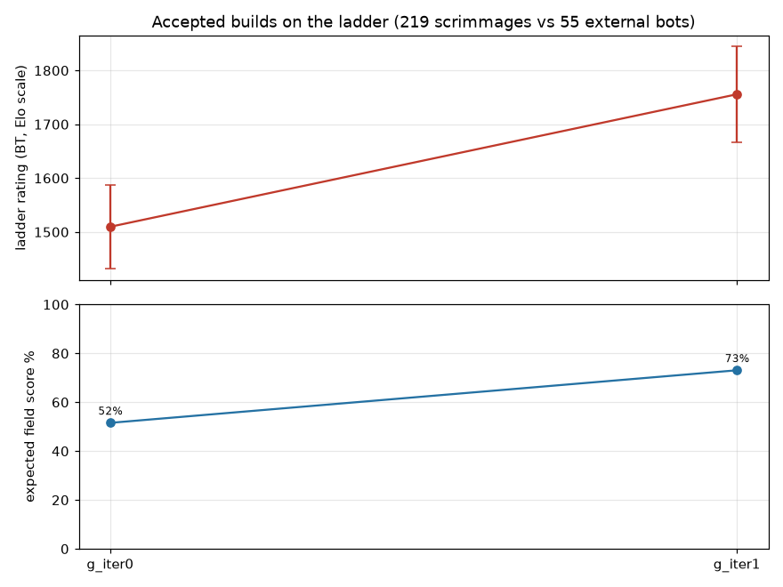

# battlecode24-vibe

A practice run at **Battlecode 2024 ("Breadwars")**: a bot trained by an AI agent (Claude Code) under an
evidence-driven loop, measured against every publicly available 2024 competitor bot on a simulated ladder.

- `TRAINING_ALGORITHM.md`: the loop (year-agnostic).
- `RULES.md`: the game, checked against the engine source.
- `TACTICS.md`: tactics opponents used against us, and our offensive and defensive progress on each.
- `TRAINING_LOG.md`: append-only record of every attempt.
- `BENCHMARK.md`: the external field and the rules for using it.
- `progress/`: ratings and charts: `progress.png` (every accepted build's ladder rating and field score), `elo.png` (the whole ladder), `ELO.md` (table).

- `research/`: digests of the five earlier practice seasons.
- `PROMPTS.md`: every owner prompt, verbatim.
