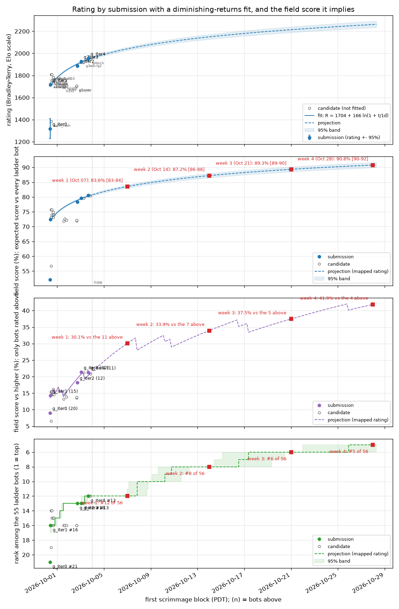

# battlecode24-vibe

A practice run at **Battlecode 2024 ("Breadwars")**: a bot trained by an AI agent (Claude Code) under an
evidence-driven loop, measured against every publicly available 2024 competitor bot on a simulated ladder.

**Current bot: `src/g_iter4`** (incumbent since 2026-10-04; ladder 1954, rank 12 of 80). See `HANDOFF.md` for the state,
`research/AUDIT-2026-10-03.md` for the audit fix that produced it (on g_iter3, the waffle crack `research/CRACK-WAFFLE.md`),
and `progress/REWRITE.md` for its statistics.

- `TRAINING_ALGORITHM.md`: the loop (year-agnostic).
- `AUDIT_PROMPT.md` / `AUDIT_PLAYBOOK.md`: the correctness audit that ended the 2024 plateau, as a reusable prompt and procedure (year-agnostic).
- `RULES.md`: the game, checked against the engine source.
- `TACTICS.md`: tactics opponents used against us, and our offensive and defensive progress on each.
- `TRAINING_LOG.md`: append-only record of every attempt.
- `BENCHMARK.md`: the external field and the rules for using it.
- `progress/`: ratings and charts: `field-score-1w.png` / `field-score-4w.png` (rating, field score, score against the bots above us, and rank for every submission and candidate, with a diminishing-returns projection to the end of week 1 and week 4 once three submissions span half a day), `progress.png` (accepted builds only), `elo.png` (the whole ladder), `ELO.md` (table).

- `research/`: digests of the five earlier practice seasons.
- `PROMPTS.md`: every owner prompt, verbatim.
